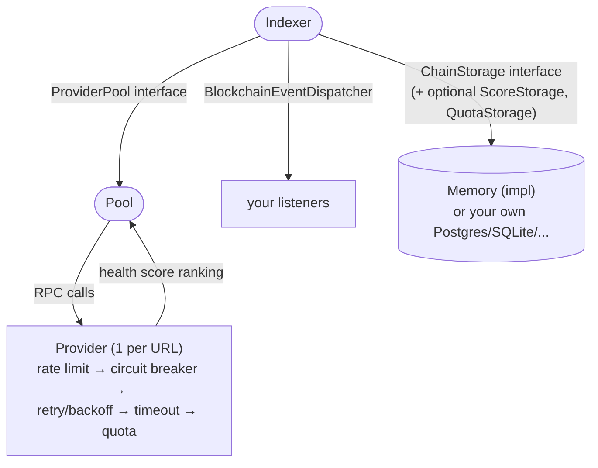

# go-block-walk

A reusable, thread-safe EVM blockchain indexer for Go: a pool of RPC
providers with health scoring, rate limiting, circuit breaking, retries
and quota tracking, feeding a block-by-block (or batched) sync loop that
dispatches decoded logs to your listeners and persists progress through a
small `ChainStorage` interface.

No concrete storage backend is bundled — implement `ChainStorage` against
your own database (that alone is a complete Indexer backend — persisting
*and restoring* provider health scores and quota usage is optional, see
[Custom storage backends](#custom-storage-backends)), or use the included
in-memory `Memory` store for tests, demos, and local development.

The public API is Go package `idx`, imported from module path
`github.com/andrewdevelop/go-block-walk`:

```go
import idx "github.com/andrewdevelop/go-block-walk"
```

## Features

- **Provider pool** (`Pool`) — dials multiple RPC endpoints, ranks them by
  `Priority` (primary key) and a live health score (tiebreaker), and
  automatically routes around unhealthy providers. `NewPool` validates its
  config (at least one provider, unique non-empty names) and returns an
  error instead of constructing a pool that can never work.
- **Per-provider resilience** — token-bucket rate limiting, circuit
  breaking ([sony/gobreaker](https://github.com/sony/gobreaker), its
  default failure filters cover 429/401/forbidden/5xx/timeout/
  connection-refused patterns), exponential backoff with jitter and a 1ms
  floor, and an optional per-attempt `RequestTimeout`, all independently
  configurable.
- **Quota tracking** — bounds requests and/or "compute unit" style credits
  (e.g. Alchemy) per provider within a rolling period, charged per physical
  RPC attempt (so retries against a metered provider are accounted for, not
  just the first try).
- **Indexer** (`Indexer`) — polls for new blocks on a timer or on demand
  (`Nudge`). Uses a low-latency, one-block-at-a-time sync path by default;
  set `PoolConfig.MaxLogBlockRange > 1` (or give a provider its own
  `ProviderConfig.MaxLogBlockRange`) and it switches to a chunked
  `eth_getLogs` batch path instead — the same setting that bounds chunk
  size also decides which path runs. Chunk size tracks whichever provider
  is currently serving requests, so a higher-priority provider with a much
  larger range limit isn't dragged down to a weaker fallback provider's
  limit; see [`PoolConfig`](#poolconfig--the-provider-pool) for how the
  two levels combine, and mid-chunk failover recovery. A block's logs are only ever marked
  processed once its header, logs and dispatch all succeed — a transient
  RPC or listener error halts progress at that block instead of silently
  skipping it, so the next tick retries it (at-least-once delivery; keep
  listeners idempotent). Optional `ReorgDepth` also detects and rewinds a
  same-height/shallow reorg, not just a full chain reset. Lifecycle is
  one-shot and safe to tear down twice: `Stop` is idempotent, and `Start`
  after `Stop` returns `ErrIndexerStopped` instead of silently doing
  nothing.
- **Pluggable, segregated storage** — `ChainStorage` (sync progress +
  indexed events) is the only thing you need to implement to back the
  indexer with your own database. `ScoreStorage` and `QuotaStorage` (health
  scores / quota bookkeeping) are separate, optional interfaces — the
  Indexer detects them via a type assertion, restores whatever they have
  persisted back onto the pool's providers at startup, and keeps persisting
  as a side effect of syncing; if your storage doesn't implement them, that
  data simply isn't tracked. `Memory` implements all three.
- **Domain errors** — `ErrNoAvailableProvider`, `ErrRetriesExhausted`,
  `ErrQuotaExceeded`, `ErrProviderPoolExhausted`, `ErrAlreadyRunning` and
  `ErrIndexerStopped` are exported sentinels you can match with
  `errors.Is`, instead of parsing error strings.
- **Everything is an interface** — `ProviderPool`, `RPCProvider`,
  `ChainStorage`, `ScoreStorage`, `QuotaStorage`, `QuotaRestorer`,
  `BlockchainListener`, `BlockchainEventDispatcher` — so any piece can be
  swapped or faked independently in your own tests.

## Install

```sh
go get github.com/andrewdevelop/go-block-walk
```

Requires Go 1.25+.

## Quick start

```go
package main

import (
	"log"
	"log/slog"
	"os"
	"time"

	"github.com/ethereum/go-ethereum/core/types"
	idx "github.com/andrewdevelop/go-block-walk"
)

// myListener handles decoded logs as the indexer discovers them.
type myListener struct{}

func (myListener) HandleLog(l types.Log, blockTimestamp uint64) error {
	log.Printf("log from tx %s at block %d (t=%d)", l.TxHash, l.BlockNumber, blockTimestamp)
	return nil
}

func main() {
	pool, err := idx.NewPool(idx.PoolConfig{
		// Pool-wide default: how many blocks a single eth_getLogs call may
		// span when the indexer batches a backfill, used for any provider
		// below that doesn't set its own MaxLogBlockRange. Defaults to 1
		// (no real batching) if left unset.
		MaxLogBlockRange: 2000,
		Providers: []idx.ProviderConfig{
			{
				Name:     "primary",
				URL:      "https://eth-mainnet.example.com",
				Priority: 1,
				RateLimit: idx.RateLimitConfig{Enabled: true, RPS: 20, Burst: 40},
				CircuitBreaker: idx.CircuitBreakerConfig{
					Enabled: true, Threshold: 5, Timeout: 30 * time.Second, HalfOpenMaxCalls: 1,
				},
				Retry:          idx.RetryConfig{MaxAttempts: 3, BaseDelay: 200 * time.Millisecond, MaxDelay: 2 * time.Second, Jitter: true},
				RequestTimeout: 10 * time.Second,
				// This provider's tier accepts a much wider eth_getLogs
				// range than the pool-wide default above — override it so
				// batching isn't dragged down to what "fallback" supports.
				MaxLogBlockRange: 10000,
			},
			{
				Name:           "fallback",
				URL:            "https://eth-mainnet.fallback.example.com",
				Priority:       2,
				RequestTimeout: 10 * time.Second,
				// No override: falls back to the pool-wide MaxLogBlockRange
				// (2000) above whenever this provider is the active one.
			},
		},
	})
	if err != nil {
		log.Fatal(err)
	}
	defer pool.Close()

	storage := idx.NewMemory() // swap for your own ChainStorage implementation in production
	dispatcher := idx.NewEventDispatcher([]idx.BlockchainListener{myListener{}})

	indexer, err := idx.NewIndexer(
		idx.IndexerConfig{
			Chain:         "ethereum",
			StartBlock:    18_000_000,
			BlockInterval: 5 * time.Second,
			// Opt in to detecting a same-height/shallow reorg (not just a full chain reset): 
			// keep the last 12 processed block hashes in memory and rewind/reprocess on a mismatch. 
			// 0 (the default) disables this check.
			ReorgDepth: 12,
		},
		pool, storage, dispatcher,
		idx.WithLogger(slog.Default()),
		// Signal for a restart once every provider has been unavailable for
		// several consecutive sync attempts in a row (see "Handling
		// provider pool exhaustion" below).
		idx.WithOnExhausted(func(err error) {
			log.Println(err)
			os.Exit(1) // let your process supervisor / container restart policy handle it
		}),
	)
	if err != nil {
		log.Fatal(err)
	}

	if err := indexer.Start(); err != nil {
		log.Fatal(err)
	}
	defer indexer.Stop()

	// Wake the indexer immediately instead of waiting for the next tick,
	// e.g. after your API receives a client's "I just sent a tx" hint.
	indexer.Nudge()

	select {} // run until the process is killed
}
```

## Architecture



- **`Provider`** wraps a single JSON-RPC endpoint (via an `EthClient`
  interface — satisfied by `*ethclient.Client`, or a fake in tests) with a
  rate limiter, circuit breaker, retry loop, optional per-attempt
  `RequestTimeout`, and quota manager — in that order, per attempt. `Close`
  is idempotent (safe to call more than once).
- **`Pool`** holds several `Provider`s and periodically re-ranks them
  (`PoolConfig.UpdateInterval`, default 30s): `Priority` (ascending — lower
  number preferred) is always the primary sort key, exactly matching the
  order at construction; health score only breaks ties between
  same-priority providers. `GetProvider` then routes each call to the
  first currently-available one in that order. `Pool.MaxLogBlockRange()`
  returns the *currently active* provider's own `ProviderConfig.MaxLogBlockRange`
  if it set one, falling back to the pool-wide `PoolConfig.MaxLogBlockRange`
  (default 1) otherwise — re-resolved on every call, so it tracks failover
  between providers with different limits instead of being pinned to
  whichever value was computed at construction. Because the provider that
  ends up serving a given `eth_getLogs` call is itself resolved
  independently (per call, not per chunk), `Indexer`'s batched sync path
  also handles a provider-with-a-smaller-limit rejecting an
  already-in-flight chunk as "range too large": it splits that chunk in
  half and retries instead of failing the whole sync. `NewPool` validates
  its config and returns `(*Pool, error)`; `Close` is idempotent.
- **`Indexer`** depends only on the `ProviderPool`, `ChainStorage` and
  `BlockchainEventDispatcher` interfaces — never on `Pool`/`Memory`
  directly — so you can inject fakes in your own tests exactly like this
  module's own test suite does. If the `ChainStorage` you hand it also
  implements `ScoreStorage`/`QuotaStorage` (detected via a type assertion),
  it restores whatever they have persisted back onto the pool's providers
  at construction, then keeps persisting both as a side effect of normal
  syncing — neither storage capability is required. `Start`/`Stop` are
  one-shot and idempotent: `Stop` can be called more than once safely, and
  `Start` after a `Stop` returns `ErrIndexerStopped` rather than launching
  a sync loop whose pool has already been torn down.

## Configuration

All config types live in [`config.go`](config.go). Every field is optional
unless stated otherwise — zero values fall back to a documented default.

### `ProviderConfig` — one upstream RPC endpoint

Passed as `PoolConfig.Providers[i]`, one per URL.

| Field            | Type                   | Default                             | Notes                                                                                                                                                                                                                                                                                                                                                                                                                                                                                                          |
|------------------|------------------------|-------------------------------------|----------------------------------------------------------------------------------------------------------------------------------------------------------------------------------------------------------------------------------------------------------------------------------------------------------------------------------------------------------------------------------------------------------------------------------------------------------------------------------------------------------------|
| `Name`           | `string`               | —                                   | **Required, must be unique** within the pool. `NewPool` rejects an empty or duplicate name.                                                                                                                                                                                                                                                                                                                                                                                                                    |
| `URL`            | `string`               | —                                   | Dialed as-is unless `APIKey` is set, in which case the client dials `"<URL>/<APIKey>"`.                                                                                                                                                                                                                                                                                                                                                                                                                        |
| `APIKey`         | `string`               | —                                   | Appended to `URL` (see above). Leave empty if your URL is already complete.                                                                                                                                                                                                                                                                                                                                                                                                                                    |
| `Priority`       | `int`                  | `0`                                 | Lower number = preferred. Primary key for `Pool`'s ranking — see [`PoolConfig`](#poolconfig--the-provider-pool) below.                                                                                                                                                                                                                                                                                                                                                                                         |
| `Dial`           | `DialFunc`             | go-ethereum `ethclient.DialContext` | Override the transport entirely — this is how tests inject a fake `EthClient` without a real endpoint.                                                                                                                                                                                                                                                                                                                                                                                                         |
| `RateLimit`      | `RateLimitConfig`      | disabled                            | Token-bucket limiter in front of every attempt.                                                                                                                                                                                                                                                                                                                                                                                                                                                                |
| `CircuitBreaker` | `CircuitBreakerConfig` | disabled                            | Trips on repeated failures; see below.                                                                                                                                                                                                                                                                                                                                                                                                                                                                         |
| `Retry`          | `RetryConfig`          | 1 attempt, no backoff               | Retry/backoff loop around each call.                                                                                                                                                                                                                                                                                                                                                                                                                                                                           |
| `Quota`          | `QuotaConfig`          | unlimited                           | Rolling request/credit budget.                                                                                                                                                                                                                                                                                                                                                                                                                                                                                 |
| `RequestTimeout` | `time.Duration`        | disabled (`0`)                      | Bounds a *single physical attempt* via `context.WithTimeout` — a short timeout doesn't starve later retries, since it's applied fresh per attempt, not once for the whole retry loop. Go-ethereum's `ethclient` has no built-in per-request timeout, so without this a stuck upstream (e.g. a dropped TCP packet with no RST) hangs the call until the caller's own context is cancelled — which may be never. **Not** applied to `SubscribeNewHead` (a long-lived subscription, not a request/response call). |
| `MaxLogBlockRange` | `int`                | `0` (defer to pool-wide)             | Overrides `PoolConfig.MaxLogBlockRange` for this one provider — set it when a provider's own `eth_getLogs` range limit differs from the rest of the pool (e.g. a higher-tier provider that accepts a much larger range). `0` means "no override": `Pool.MaxLogBlockRange()` falls back to the pool-wide value whenever this provider is the one currently active.                                                                                                                                          |

A dial failure at construction doesn't fail `NewProvider`/`NewPool` — the
provider is simply marked unavailable (`IsAvailable() == false`) and the
pool routes around it, the same as a circuit-broken or quota-exhausted one.

### `RateLimitConfig`

| Field     | Type      | Default | Notes                                                          |
|-----------|-----------|---------|----------------------------------------------------------------|
| `Enabled` | `bool`    | `false` | If `false`, every other field is ignored — no limiting at all. |
| `RPS`     | `float64` | —       | Sustained requests/second (`golang.org/x/time/rate.Limit`).    |
| `Burst`   | `int`     | —       | Token-bucket burst size.                                       |

### `CircuitBreakerConfig`

Wraps [`sony/gobreaker`](https://github.com/sony/gobreaker).

| Field              | Type            | Default | Notes                                                                                                                                  |
|--------------------|-----------------|---------|----------------------------------------------------------------------------------------------------------------------------------------|
| `Enabled`          | `bool`          | `false` | If `false`, calls always execute directly — `IsAvailable()` always reports `true`.                                                     |
| `Threshold`        | `int`           | `0`     | Trips once `TotalFailures >= Threshold` **and** the failure ratio is `>= 50%` within the rolling window — both conditions, not either. |
| `Timeout`          | `time.Duration` | `0`     | `gobreaker`'s open→half-open recovery timeout (and counting-window interval).                                                          |
| `HalfOpenMaxCalls` | `int`           | `0`     | Trial calls allowed while half-open before deciding to close or re-open.                                                               |
| `FilterErrors`     | `[]string`      | —       | Extra case-insensitive substrings that count as a *breaker-tripping* failure, added on top of the built-in set below.                  |

An error only trips the breaker if it matches one of these substrings —
anything else (e.g. an application-level "not found") is treated as a
breaker *success* and never counts against `Threshold`, so it can't
accidentally punish a provider for a caller error. The built-in set:

```
429, 401, unauthorized, rate limit, forbidden,
context deadline, connection refused, timeout,
500, 502, 503, 504,
internal error, internal server error,
service unavailable, bad gateway, gateway timeout
```

### `RetryConfig`

| Field         | Type            | Default   | Notes                                                                                                                                                                                            |
|---------------|-----------------|-----------|--------------------------------------------------------------------------------------------------------------------------------------------------------------------------------------------------|
| `MaxAttempts` | `int`           | `1`       | Zero or negative is treated as `1` (a single attempt, no retry).                                                                                                                                 |
| `BaseDelay`   | `time.Duration` | `0`       | Backoff after attempt *n* is `BaseDelay × 2^(n-1)`, floored at 1ms even if `BaseDelay` is `0` — a misconfigured-but-retrying provider still gets a pause between attempts instead of a hot loop. |
| `MaxDelay`    | `time.Duration` | unbounded | Caps the exponential growth above.                                                                                                                                                               |
| `Jitter`      | `bool`          | `false`   | Adds up to `+50%` random jitter on top of the computed delay.                                                                                                                                    |

Only errors matching a *retryable* substring are retried at all —
`429`, `rate limit`, `timeout`, `context deadline`, `connection refused`,
`network`, `temporary` — with `401`/`unauthorized`/`forbidden` always
winning as non-retryable even if a retryable substring also appears in the
same message. Anything matching neither list is treated as non-retryable
and returned immediately on the first attempt. This is deliberately
coarse, substring-based classification (not typed JSON-RPC error codes,
which go-ethereum's `ethclient` doesn't expose) — write error messages your
upstreams actually return in mind if you rely on it.

Once every attempt is exhausted, the returned error wraps both
`ErrRetriesExhausted` and the last underlying error, so `errors.Is` works
for either.

### `QuotaConfig` / `CreditsConfig`

| Field     | Type             | Default          | Notes                                                                                           |
|-----------|------------------|------------------|-------------------------------------------------------------------------------------------------|
| `Limit`   | `int64`          | `0` (unlimited)  | Max requests within `Period`.                                                                   |
| `Period`  | `time.Duration`  | —                | Rolling window; resets `Limit`/`Credits` usage back to zero once it elapses.                    |
| `Credits` | `*CreditsConfig` | `nil` (disabled) | Optional secondary "compute unit" style meter (e.g. Alchemy), checked *in addition to* `Limit`. |

`CreditsConfig`: `Enabled bool`, `PerRequest int64` (credits charged per
attempt), `Limit int64`, `Period time.Duration` (its own independent
rolling window).

Quota is consumed **per physical RPC attempt**, not once per logical call —
a request retried 3 times under `RetryConfig.MaxAttempts: 3` is charged 3
times if all 3 attempts actually go out over the wire, matching how a
metered provider like Alchemy bills you. Once quota (or credits) for the
current period is exhausted, further attempts fail fast with
`ErrQuotaExceeded` without touching the rate limiter or circuit breaker,
and the provider reports `IsAvailable() == false` until the period rolls
over — checking availability never itself consumes quota.

If your `ChainStorage` also implements `QuotaStorage`, usage is persisted
as a side effect of syncing; if the provider additionally implements the
`QuotaRestorer` interface (`*Provider` does), that persisted usage is
restored at `NewIndexer` construction, so a restart doesn't forget how much
of the current period was already spent. See [Custom storage
backends](#custom-storage-backends).

### `PoolConfig` — the provider pool

| Field              | Type               | Default | Notes                                                                                                                                                                                                  |
|--------------------|--------------------|---------|--------------------------------------------------------------------------------------------------------------------------------------------------------------------------------------------------------|
| `Providers`        | `[]ProviderConfig` | —       | **Required, at least one.** `NewPool` returns an error for an empty list or a duplicate/empty `Name`.                                                                                                  |
| `UpdateInterval`   | `time.Duration`    | `30s`   | How often `Pool` re-ranks providers by health score/quota penalty.                                                                                                                                     |
| `MaxLogBlockRange` | `int`              | `1`     | Pool-wide default eth_getLogs chunk size, used for any provider that doesn't set its own `ProviderConfig.MaxLogBlockRange` — also what decides whether `Indexer` uses the sequential or batched sync path (`Pool.MaxLogBlockRange() > 1` → batched). Zero or negative also falls back to `1`. |

Ranking is **`Priority` ascending first, health score descending only to
break ties** between providers that share the same `Priority` — a
lower-priority-number provider is always preferred over a higher-numbered
one as long as it's available (`IsAvailable()`), regardless of how their
scores compare. `GetProvider()` returns the first available provider in
that order.

Health score itself starts at `Priority` and moves by `+0.1` per success
(capped at `2×Priority`, or `1.0` if `Priority <= 0`) and `-0.2` per
failure; it drops below `-1.0` marks the provider unhealthy until a
success recovers it. `recalculateScores` additionally applies a penalty
(`-10` at request-quota exhaustion, `-5` at credits exhaustion) on top of
that score during each `UpdateInterval` tick — `RecordFailure` itself
skips its own penalty for an `ErrQuotaExceeded` result, so quota
exhaustion isn't double-penalized.

### `IndexerConfig`

| Field                              | Type            | Default        | Notes                                                                                                                                                                        |
|------------------------------------|-----------------|----------------|------------------------------------------------------------------------------------------------------------------------------------------------------------------------------|
| `Chain`                            | `string`        | —              | **Required.** An arbitrary identifier scoping all storage calls (`ChainStorage` methods take it as a parameter) — lets one `ChainStorage` back multiple chains.              |
| `StartBlock`                       | `uint64`        | —              | Where a *fresh* (nothing persisted yet) sync begins. Ignored once anything has been persisted for `Chain`.                                                                   |
| `BlockInterval`                    | `time.Duration` | —              | **Required, must be positive.** Polling tick interval; `Nudge()` triggers an out-of-band sync early and resets this ticker.                                                  |
| `MaxConsecutiveProviderExhaustion` | `int`           | `5`            | Consecutive sync attempts with no available provider before `WithOnExhausted`'s callback fires. See [Handling provider pool exhaustion](#handling-provider-pool-exhaustion). |
| `ProviderExhaustionRestartDelay`   | `time.Duration` | `15s`          | How long the sync loop waits before invoking the exhaustion callback once the threshold above is crossed.                                                                    |
| `DebugMode`                        | `bool`          | `false`        | Re-processes from genesis every tick instead of resuming from the persisted last block, and never writes `SetLastBlock`. Local development only.                             |
| `ReorgDepth`                       | `int`           | `0` (disabled) | Opts into detecting a reorg beyond a full chain reset. `0` preserves prior behaviour (only `currentBlock < lastBlock` is treated as a reorg — a full reset). See below.      |

#### Reorg detection (`ReorgDepth`)

With `ReorgDepth > 0`, the `Indexer` keeps the last `ReorgDepth` processed
block hashes **in memory** (not persisted) and, each sync, re-verifies that
the chain's current hash at `lastBlock` still matches what was recorded
when that block was processed. A mismatch — same height, or a few blocks
deep, not necessarily a full reset — means a reorg happened at or below
`lastBlock`: the `Indexer` rewinds up to `ReorgDepth` blocks (never past
`StartBlock`) and reprocesses them, relying on **idempotent listeners** to
make the re-delivery safe (the same contract the rest of the sync loop
already relies on for at-least-once delivery on any error).

Because the tracked hashes are in-memory only, this protects a
continuously running process but not a process that just restarted — a
fresh `Indexer` has nothing to compare against until it has processed
`ReorgDepth` more blocks after startup.

### `NewIndexer` options

Functional options, passed as the trailing arguments to `NewIndexer`:

| Option                         | Notes                                                                                             |
|--------------------------------|---------------------------------------------------------------------------------------------------|
| `WithLogger(*slog.Logger)`     | Defaults to `slog.Default()`.                                                                     |
| `WithOnExhausted(func(error))` | Defaults to a no-op. See [Handling provider pool exhaustion](#handling-provider-pool-exhaustion). |

### Domain errors

All exported sentinels (see [`errors.go`](errors.go)), matchable with
`errors.Is`:

| Error                      | Returned by                              | Meaning                                                                                          |
|----------------------------|------------------------------------------|--------------------------------------------------------------------------------------------------|
| `ErrNoAvailableProvider`   | `ProviderPool` RPC methods               | Every provider is unhealthy, circuit-broken, or quota-exhausted right now.                       |
| `ErrQuotaExceeded`         | `Provider`/`Pool` RPC methods            | This attempt would exceed the provider's request or credit quota; not retried.                   |
| `ErrRetriesExhausted`      | `WithRetry` / `Provider` RPC methods     | Every configured attempt failed on a retryable error; wraps the last underlying error too.       |
| `ErrProviderPoolExhausted` | Passed into `WithOnExhausted`'s callback | No provider has been available for `MaxConsecutiveProviderExhaustion` consecutive sync attempts. |
| `ErrAlreadyRunning`        | `Indexer.Start`                          | The indexer is already running.                                                                  |
| `ErrIndexerStopped`        | `Indexer.Start`                          | `Stop` was already called; an `Indexer` is one-shot — build a new one instead of restarting.     |

## Handling provider pool exhaustion

If the pool has had **no available provider** (every circuit breaker open,
every quota exhausted) for `IndexerConfig.MaxConsecutiveProviderExhaustion`
consecutive sync attempts (default 5), the indexer treats that as unlikely
to self-heal by simply waiting for the next tick. It waits
`ProviderExhaustionRestartDelay` (default 15s), then calls the callback
registered via `idx.WithOnExhausted`, passing an error that wraps
`idx.ErrProviderPoolExhausted`:

```go
idx.WithOnExhausted(func(err error) {
	if errors.Is(err, idx.ErrProviderPoolExhausted) {
		log.Println("indexer: restarting due to provider exhaustion:", err)
		os.Exit(1) // e.g. docker-compose `restart: unless-stopped` brings it back with fresh breakers
	}
})
```

The default callback is a no-op — the loop just keeps retrying on the next
tick — so opting into a restart is a deliberate choice, not baked-in
`os.Exit` behaviour.

## Custom storage backends

Persistence is split into three interfaces (see `ports.go`) instead of one
monolithic `Storage`, so implementing a backend only costs you what you
actually use:

```go
// Required — the only thing NewIndexer needs.
type ChainStorage interface {
	GetLastBlock(ctx context.Context, chain string) (uint64, error)
	SetLastBlock(ctx context.Context, chain string, blockNum uint64) error

	SaveIndexedEvent(ctx context.Context, event *IndexedEvent) error
	GetIndexedEvents(ctx context.Context, chain string, fromBlock, toBlock uint64) ([]IndexedEvent, error)
	IsEventIndexed(ctx context.Context, chain string, blockNumber uint64, logIndex uint) (bool, error)

	Close() error
}

// Optional — implement it and the Indexer persists provider health scores
// as a side effect of syncing; skip it and that's simply not tracked.
type ScoreStorage interface {
	GetProviderScore(ctx context.Context, provider string) (*ProviderScore, error)
	SetProviderScore(ctx context.Context, provider string, score, penalty float64) error
	GetAllProviderScores(ctx context.Context) ([]ProviderScore, error)
}

// Optional — same deal, for provider quota usage.
type QuotaStorage interface {
	GetQuotaUsage(ctx context.Context, provider, quotaType string) (*QuotaUsage, error)
	SetQuotaUsage(ctx context.Context, provider, quotaType string, used int, resetAt time.Time) error
}

// Storage = ChainStorage + ScoreStorage + QuotaStorage, provided purely as
// a "my backend does all three" shorthand. Memory implements it.
type Storage interface {
	ChainStorage
	ScoreStorage
	QuotaStorage
}
```

`NewIndexer` takes a `ChainStorage`; at construction it type-asserts that
value against `ScoreStorage` and `QuotaStorage`, and if either is present:

1. **Restores** whatever was previously persisted back onto the pool's
   providers right away — `RPCProvider.SetScore` for health score, and (if
   the concrete provider additionally implements `QuotaRestorer`, which
   `*Provider` does) `RestoreQuotaUsage` for request-quota usage. This is
   what makes a restart not forget a provider was unhealthy or had already
   spent part of its quota this period. Nothing persisted yet for a
   provider just leaves it at its construction-time defaults.
2. **Persists** both, going forward, as a side effect of normal syncing.

A store backing only `ChainStorage` — no score/quota tracking at all — is
a complete, valid Indexer backend (see
`tests/storage_segregation_test.go`'s `chainOnlyStorage` for a minimal
example). `Pool.PersistQuotaUsage` likewise only asks for `QuotaStorage`.

```go
// QuotaRestorer is implemented by an RPCProvider that can have persisted
// quota usage applied back to it — checked via type assertion, same
// optional-capability pattern as ScoreStorage/QuotaStorage themselves.
// *Provider implements it; a fake RPCProvider in your own tests doesn't
// need to.
type QuotaRestorer interface {
	RestoreQuotaUsage(used int64, resetAt time.Time)
}
```

Only request-quota usage round-trips this way — credits (the optional
secondary "compute unit" meter, see `CreditsConfig`) aren't persisted, so
they aren't restored either.

`Memory` mirrors this split internally rather than being one 200-line type:
it's a thin composition of three independent, independently testable
pieces, each with its own lock —

```go
type Memory struct {
	*MemoryChainStorage
	*MemoryScoreStorage
	*MemoryQuotaStorage
}
```

— so `idx.NewMemoryChainStorage()` alone is a real, usable `ChainStorage`
if that's genuinely all you want in memory (e.g. in a test), without
allocating score/quota bookkeeping you'll never touch.

`SaveIndexedEvent` must be idempotent under a duplicate `(chain,
block_number, log_index)` key — `Memory` treats a duplicate insert as a
silent no-op (mirroring an SQL `ON CONFLICT DO NOTHING` upsert), so a
concurrent-safe SQL backend should do the same.

## Testing

All tests live under [`tests/`](tests/) as a **black-box** suite
(`package idx_test`), exercising only this module's exported API — Go
requires unexported-access ("white-box") tests to live beside the package
they test, so keeping test files in their own directory means testing
through the public surface only, the same way any consumer of this module
would.

Most files are focused unit tests (one component at a time). One test,
[`tests/integration_test.go`](tests/integration_test.go)'s
`TestIntegration_FullPipeline`, wires up a real `Pool` + `Provider` +
`Memory` + `Indexer` + `EventDispatcher` together (only the JSON-RPC
transport is faked) and drives the whole thing through a realistic
lifecycle in one run: failover past a dead provider, transient errors
recovered by retry, a burst of blocks forcing the chunked batch path,
health-score/quota persistence, and finally a permanently broken provider
tripping its circuit breaker until the pool is exhausted and
`ErrProviderPoolExhausted` fires through `WithOnExhausted`.

```sh
go test ./...                                    # run everything
go test ./... -race                              # with the race detector
go test ./tests/... -coverpkg=./... -cover       # coverage of the idx package itself
go test ./tests/... -run TestIntegration -v      # just the end-to-end pipeline test
```

...or via the [Makefile](Makefile): `make test`, `make test-race`, `make cover`.

### Opt-in: testing against a real Hardhat node

[`tests/hardhat_test.go`](tests/hardhat_test.go) talks to an actual
JSON-RPC node instead of a fake — real dial, real `eth_blockNumber` /
`eth_getLogs` / etc. `TestHardhat_IndexerTracksRealChain` goes further than
just watching the chain head move: it deploys a tiny contract whose init
code unconditionally emits a log, then asserts the `Indexer`'s registered
`BlockchainListener` actually received *that* log (matching `TxHash` and
contract `Address`) — proof the full dispatch pipeline works against a real
node, not just that polling advances. It's built only with `-tags hardhat`,
so it's invisible to `go test ./...` and CI's default run, and skips (not
fails) if no node is reachable — this is an opt-in, manual test, not
something every contributor needs to run.

Start a Hardhat node yourself first (this repo doesn't manage it):

```sh
npx hardhat node   # listens on :8545 by default
```

Then, in another terminal:

```sh
make test-hardhat        # HARDHAT_RPC_URL defaults to http://127.0.0.1:8545
make test-hardhat-race   # same, with -race
make test-all            # the fast suite + the Hardhat suite, both with -race
```

Point it at a different node with `HARDHAT_RPC_URL=http://host:port make test-hardhat`.

## Project layout

```
.
├── ports.go        interfaces + data types (RPCProvider, ProviderPool, ChainStorage, ScoreStorage, QuotaStorage, ...)
├── config.go        config structs (RateLimitConfig, CircuitBreakerConfig, RetryConfig, ...)
├── errors.go        exported sentinel errors
├── ethclient.go      EthClient interface + default go-ethereum dial
├── provider.go       Provider + QuotaManager
├── pool.go           Pool
├── ratelimit.go       RateLimiter
├── breaker.go        CircuitBreaker
├── retry.go          WithRetry / backoff
├── dispatcher.go       EventDispatcher
├── exhaustion.go       ExhaustionTracker
├── nudge.go          NudgeSignal
├── indexer.go        Indexer (the sync loop)
├── memory.go          Memory (composes the three pieces below into the full Storage)
├── memorychain.go     MemoryChainStorage (in-memory ChainStorage)
├── memoryscore.go     MemoryScoreStorage (in-memory ScoreStorage)
├── memoryquota.go     MemoryQuotaStorage (in-memory QuotaStorage)
├── Makefile          build/test/cover/test-hardhat targets
└── tests/            black-box test suite (package idx_test)
    └── hardhat_test.go  opt-in, real-node test (build tag "hardhat")
```
